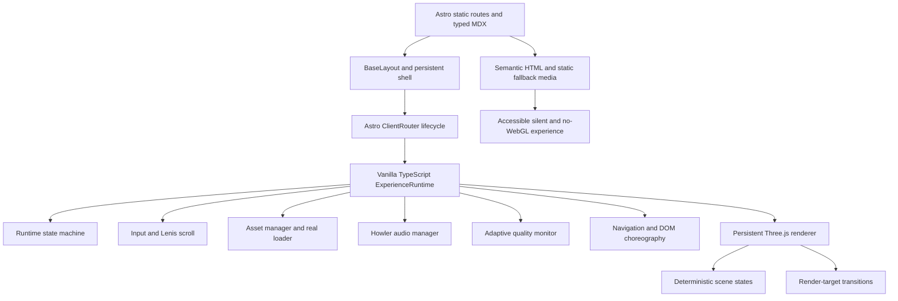
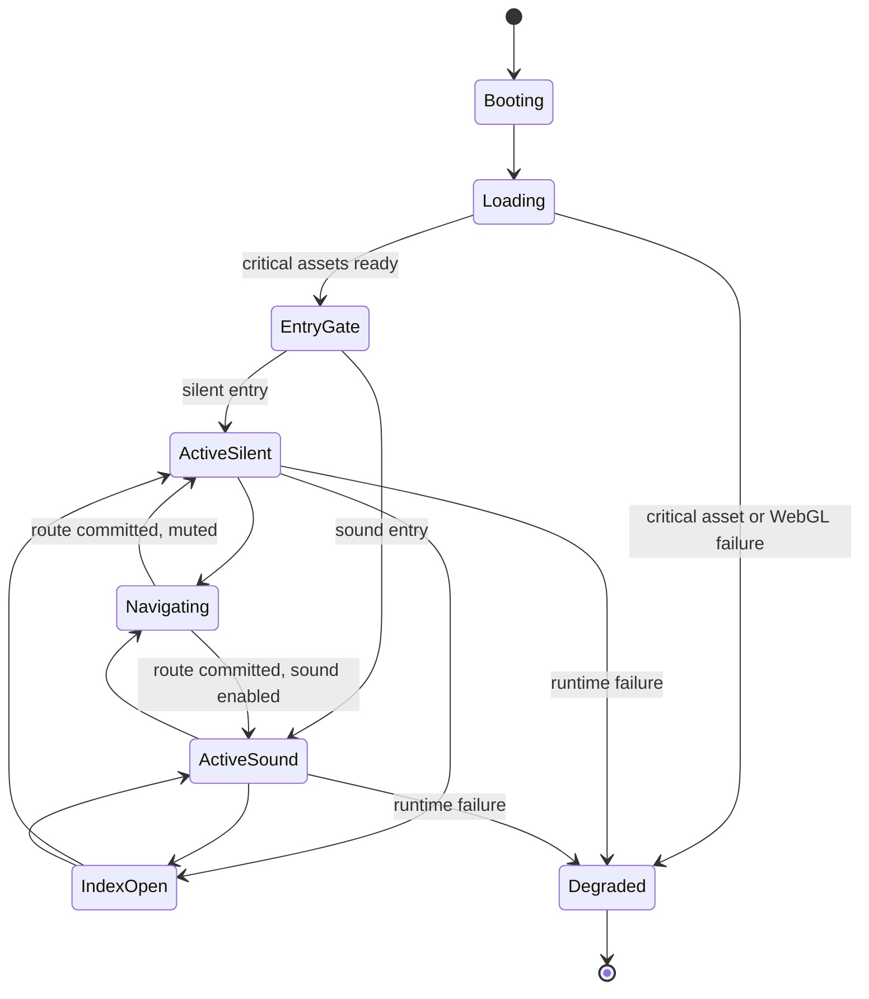

# Reference-Faithful Portfolio Redesign Implementation Plan

> **For agentic workers:** REQUIRED SUB-SKILL: Use `subagent-driven-development` (recommended) or `executing-plans` to implement this plan task-by-task. Steps use checkbox (`- [ ]`) syntax for tracking.

**Goal:** Rebuild the portfolio as an original, award-caliber creative developer experience that closely matches the observable structure, pacing, interaction quality, transitions, WebGL presence, and opt-in sound experience of [rogierdeboeve.com](https://rogierdeboeve.com/) while using only Ishraful Haque's identity, verified work, original source code, and original media.

**Architecture:** Astro supplies statically rendered, content-first routes and typed MDX. A framework-independent vanilla TypeScript runtime persists across Astro route swaps and owns one Three.js/Alien.js renderer, deterministic scene state, transitions, input, quality adaptation, assets, and audio. DOM choreography uses Motion, eligible smooth scrolling uses Lenis, and Howler controls a fully optional original sound layer.

**Tech Stack:** Node.js 22.22.3, Astro 7.1.2, TypeScript 6.0.3, Three.js 0.185.1, Alien.js 1.2.0, Space.js 1.2.0, Motion 12.42.2, Lenis 1.3.25, Howler.js 2.2.4, Sharp 0.35.3, Vitest 4.1.10, Playwright 1.61.1, axe-core, Lighthouse CI, and repository-based MDX.

## Global Constraints

- Preserve and redesign every current public route: `/`, `/about`, `/projects`, `/experience`, `/skills`, `/uses`, `/notes`, `/now`, `/contact`, and `/blog`.
- Add native project case studies, Writing, Lab, and Archive experiences without sending visitors to an external blog.
- Use `lxrdxe7o` as the primary hero identity, `Full-Stack Developer` as the title, and `Ishraful Haque` as the supporting signature.
- Use one restrained crimson signature across the site; do not retain route-specific rainbow themes.
- Match the reference's observable components, sequencing, transitions, interaction physics, audio behavior, and WebGL feel as closely as practical.
- Do not copy reference source code, shaders, branding, copy, fonts, images, video, 3D assets, or audio.
- Use only free and open-source runtime dependencies and distributable assets. Pin dependency versions exactly in `package.json`.
- GSAP remains excluded because the approved dependency policy requires OSI-style open-source licensing. Motion provides DOM choreography instead.
- Never fabricate clients, employers, awards, testimonials, dates, metrics, outcomes, project status, or proficiency. Unverified claims remain unpublished.
- Public repositories and profile data may be used as factual input, but generated copy and project selection require user approval.
- Audio must be opt-in. Sound and silent entry paths must have complete feature parity, persistent preference, and an always-available mute control.
- Provide high-quality desktop and mobile compositions, adaptive WebGL quality, a reduced-motion mode, a static no-WebGL mode, and resilient failure states.
- Meet WCAG 2.2 AA and support keyboard, touch, mouse, coarse pointer, screen reader, zoom, reduced motion, reduced data, and forced-colors use.
- Browser floor: current and previous Chrome, Firefox, Safari, and Edge; iOS Safari 16 or newer; current Android Chrome.
- Performance targets: LCP at or below 2.5 seconds, INP at or below 200 milliseconds, CLS at or below 0.1, one WebGL context, stable 60 FPS on capable desktops, and stable 30 FPS through adaptive downgrades.
- Do not make a commit, push, or Git-history change unless the user explicitly requests it.

---

## 1. Problem Statement

The current React/Vite portfolio is organized around hardcoded route content, repeated glass-card patterns, unrelated color themes, and route-specific rendering approaches. Its large global stylesheet contains overlapping rules, pointer movement can trigger React renders, some visuals mutate buffers on the CPU each frame, random values are not reproducible, DPR is not tightly bounded, and there is no unified loader, audio lifecycle, case-study system, media pipeline, native article body, deterministic transition runtime, or comprehensive test suite.

The redesign must replace that fragmented direction with one coherent identity system and a cinematic route loop. Creative recognition is the primary objective. Employment, freelance conversion, and open-source visibility remain important secondary outcomes, so spectacle must never compromise legibility, factual credibility, navigation, accessibility, or loading performance.

## 2. Locked Product Requirements

### 2.1 Identity and audience

- Primary mark: `lxrdxe7o`
- Professional title: `Full-Stack Developer`
- Human signature: `Ishraful Haque`
- Primary audience: design-conscious clients, creative-development peers, studios, award juries, and senior technical recruiters
- Primary outcome: memorable creative recognition and award-caliber frontend presentation
- Secondary outcomes: qualified employment interest, freelance inquiries, and open-source discovery

### 2.2 Experience model

1. A real asset-loading sequence shows meaningful progress rather than a cosmetic timer.
2. The entry gate offers `Enter with sound` and `Enter without sound` before audio playback begins.
3. The home route leads with oversized identity typography, restrained controls, availability, social links, and an interactive path into Work.
4. Work and About remain the most prominent controls.
5. A full-screen animated Index exposes every major route and can be opened from anywhere.
6. Project routes share a consistent editorial sequence: title, hero, synopsis, optional live link, verified metadata, supporting media, process narrative, next-project handoff, and contact footer.
7. About and supporting routes use the same typography, motion grammar, and visual world rather than unrelated page themes.
8. Page changes combine DOM choreography with render-target or scene-state transitions inside the persistent canvas.
9. Pointer, touch, keyboard, and scroll input are normalized into one runtime signal model.
10. Sound enriches ambience, interaction, and route handoffs only after consent; silent mode remains first-class.

### 2.3 Content rules

- Repository-based typed MDX is the source of truth for projects, writing, notes, and lab entries.
- Every factual claim records provenance and publication status.
- Missing facts are surfaced in an editorial report and omitted from public output.
- Project curation happens only after a public-repository audit and explicit user approval.
- Screenshots, videos, procedural artwork, 3D scenes, and audio are produced specifically for this portfolio.
- Contact and availability copy must be explicitly approved before release.

### 2.4 Design dials

| Dial | Approved value | Consequence |
|---|---:|---|
| Design variance | 9/10 | Bold composition, unusual scale, and strong visual authorship are encouraged. |
| Motion intensity | 10/10 | The full experience may be highly kinetic, with complete reduced-motion alternatives. |
| Visual density | 3/10 | Keep interfaces sparse, editorial, and image-led; avoid dashboard density and nested card grids. |

## 3. Research Findings

### 3.1 Reference experience

Public inspection of the reference identified these transferable behavioral patterns:

- A loader tied to actual progress, followed by separate sound and silent entry choices.
- Oversized identity typography with minimal permanent navigation.
- Work/About emphasis, social links, availability, and an interactive project Index.
- A repeated project template with strong media pacing, concise metadata, looping navigation, and contact handoff.
- About modules for biography, selected collaborators, recognition, tools, typography, and sound credits.
- A persistent WebGL layer that makes routes feel like states in one world rather than isolated pages.
- Smooth inertial scrolling, pointer-responsive imagery, carefully staged text reveals, and sound transitions.

The implementation may reproduce these observable patterns but must derive original layouts, motion curves, shaders, media, and sound from this portfolio's identity and content.

### 3.2 Current repository

- Runtime: React 18, Vite 6, TanStack Router, Framer Motion, Three.js, React Three Fiber, and Drei.
- Content: primarily hardcoded route components with no typed editorial source.
- Styling: one large global stylesheet, repeated glass surfaces, and route-specific rainbow accents.
- Rendering: multiple component-driven patterns instead of one deterministic resource owner.
- Performance risks: React pointer state, direct scroll listeners, CPU-side per-frame buffer changes, unseeded randomness, and permissive DPR.
- Product gaps: no complete case-study loop, native long-form writing, asset production workflow, opt-in audio runtime, adaptive quality controller, robust static fallback, or cross-browser automated validation.

### 3.3 Approved technology research

The reference publicly exposes an Astro, Three.js, Alien.js, Lenis, GSAP, and Howler-style stack. The approved implementation retains the architectural ideas that fit the project but replaces GSAP with open-source Motion. Neue Haas Grotesk is not copied; open-source Geist provides the display/sans role and JetBrains Mono 2.304 provides the technical mono role. No additional user-recommended research resources were supplied.

Research still required during implementation is deliberately isolated in the plan:

- Task 1 records reference behavior and current-site baselines.
- Task 4 audits public repositories and factual profile data.
- Task 5 validates capture and encoding behavior for original project media.
- Task 12 prototypes and licenses the original sound layer.
- Tasks 26 and 27 compare parity, accessibility, browser behavior, and performance against objective evidence.

## 4. Proposed Architecture



### 4.1 Runtime boundaries

- Astro owns HTML generation, route discovery, metadata, content collections, RSS, sitemap data, and no-JavaScript readability.
- `ExperienceRuntime` is created once in the persistent shell and exposes explicit lifecycle methods: `boot()`, `enter(mode)`, `prepareNavigation()`, `commitNavigation()`, `setRoute()`, `setIndexOpen()`, `setMuted()`, and `destroy()`.
- The renderer owns exactly one canvas and one `WebGLRenderer`. Route states supply deterministic scene parameters rather than mounting independent render trees.
- Astro navigation events coordinate outgoing DOM animation, asset preparation, document swapping, route-state activation, focus restoration, and incoming animation.
- Motion animates DOM transforms and opacity. Lenis is enabled only when motion preferences, input method, and device capability allow it.
- Howler loads and plays only original local assets after explicit consent.
- Static route content and fallback media remain usable when JavaScript, audio, WebGL, or smooth scrolling is unavailable.

### 4.2 Runtime state model



The state machine is authoritative. UI controls dispatch events and render from state; they do not maintain competing booleans for loading, navigation, index, mute, or quality.

### 4.3 Adaptive rendering tiers

| Tier | Selection | Rendering behavior |
|---|---|---|
| Static | no WebGL, reduced data, runtime failure, or explicit fallback | Responsive images/posters, semantic content, no canvas dependency |
| Low | constrained GPU, sustained frame pressure, or battery-sensitive mobile | DPR capped at 1, reduced particles, simplified materials, 30 FPS target |
| Medium | typical mobile/tablet and integrated desktop GPU | DPR capped at 1.5, moderate post-processing, 45-60 FPS target |
| High | capable desktop with stable frame budget | DPR capped at 2, complete scene detail and transition treatment, 60 FPS target |

Quality changes use hysteresis. A sustained regression can lower one tier; an upgrade requires a substantially longer stable interval. Quality never oscillates frame-by-frame.

### 4.4 Audio model

- `unknown`: no choice has been made and no sound may play.
- `silent`: all interaction and navigation features work with audio disabled.
- `enabled`: ambience, interaction cues, and route transitions may play.
- `muted`: consent remains remembered but output is temporarily silent.
- Preferences persist locally and are exposed through a labeled global control.
- Route ambience crossfades; no clip starts abruptly or continues after its owner releases it.
- Reduced motion does not force audio off, and audio consent does not force motion on.

## 5. Pinned Foundation

All npm dependency declarations use exact versions without `^`, `~`, `latest`, or wildcard ranges.

| Package/tool | Version | Role |
|---|---:|---|
| Node.js | 22.22.3 | Build and tooling runtime |
| Astro | 7.1.2 | Static routes, content, and navigation shell |
| `@astrojs/mdx` | 7.0.3 | Typed MDX pages |
| TypeScript | 6.0.3 | Strict type checking |
| `@astrojs/check` | 0.9.9 | Astro and TypeScript validation |
| Three.js | 0.185.1 | Persistent WebGL renderer |
| `@alienkitty/alien.js` | 1.2.0 | WebGL utilities and transition primitives |
| `@alienkitty/space.js` | 1.2.0 | Scene and spatial utilities |
| Motion | 12.42.2 | DOM animation timelines |
| Lenis | 1.3.25 | Conditional smooth scrolling |
| Howler.js | 2.2.4 | Opt-in audio playback and crossfades |
| `@types/howler` | 2.2.13 | Audio types |
| Sharp | 0.35.3 | Deterministic image transformation |
| Vitest | 4.1.10 | Unit and integration tests |
| Playwright | 1.61.1 | Browser, visual, and interaction tests |
| `@axe-core/playwright` | 4.12.1 | Automated accessibility checks |
| Lighthouse CI | 0.15.1 | Performance budgets |
| `web-vitals` | 5.3.0 | Field-compatible metric instrumentation |
| ESLint | 10.7.0 | Static analysis |
| `eslint-plugin-astro` | 3.0.1 | Astro lint rules |
| `typescript-eslint` | 8.64.0 | TypeScript lint rules |
| Geist | 1.7.2 | Open-source display and sans family |
| JetBrains Mono | 2.304 | Open-source mono font, self-hosted |

Before installation, implementation must verify package names, published versions, licenses, and peer compatibility against official package metadata. If an approved version is unavailable or incompatible, stop and present evidence before substituting it.

## 6. Planned Repository Structure

```text
.
├── astro.config.mjs
├── eslint.config.js
├── package.json
├── playwright.config.ts
├── tsconfig.json
├── vitest.config.ts
├── public/
│   ├── audio/
│   ├── fonts/
│   ├── images/
│   ├── media/
│   ├── models/
│   └── social/
├── scripts/
│   ├── audit/
│   ├── audio/
│   ├── capture/
│   ├── media/
│   └── reference/
├── src/
│   ├── components/
│   │   ├── about/
│   │   ├── content/
│   │   ├── lab/
│   │   ├── projects/
│   │   └── shell/
│   ├── content/
│   │   ├── lab/
│   │   ├── notes/
│   │   ├── projects/
│   │   └── writing/
│   ├── content.config.ts
│   ├── data/
│   │   ├── facts.ts
│   │   ├── navigation.ts
│   │   └── route-manifests.ts
│   ├── layouts/
│   │   ├── BaseLayout.astro
│   │   └── ContentLayout.astro
│   ├── pages/
│   │   ├── projects/
│   │   ├── writing/
│   │   ├── notes/
│   │   ├── lab/
│   │   └── route pages
│   ├── runtime/
│   │   ├── assets/
│   │   ├── audio/
│   │   ├── core/
│   │   ├── input/
│   │   ├── navigation/
│   │   ├── quality/
│   │   ├── rendering/
│   │   ├── scroll/
│   │   └── transitions/
│   ├── styles/
│   │   ├── base.css
│   │   ├── components.css
│   │   ├── motion.css
│   │   ├── tokens.css
│   │   └── utilities.css
│   └── types/
├── tests/
│   ├── accessibility/
│   ├── e2e/
│   ├── fixtures/
│   ├── integration/
│   ├── performance/
│   ├── unit/
│   └── visual/
└── plan.md
```

Existing React/TanStack/R3F files are removed only after Astro route parity and test coverage are established. Generated screenshots, videos, reports, and temporary audit payloads live under ignored `artifacts/` directories; approved optimized public assets live under `public/` with manifests and attribution records.

## 7. Implementation Strategy

Convert the design into a series of tasks that will build each component in a test-driven manner following agile best practices. Each task must result in a working, demoable increment of functionality. Prioritize best practices, incremental progress, and early testing, ensuring no big jumps in complexity at any stage. Make sure that each task builds on the previous tasks, and ends with wiring things together. There should be no hanging or orphaned code that isn't integrated into a previous task.

Every task follows the same delivery cycle:

1. Add a focused failing unit, integration, browser, visual, or accessibility test for the behavior named in that task.
2. Run the narrow test and confirm that it fails for the intended missing behavior.
3. Implement the smallest complete production path that satisfies the test and integrates with all prior tasks.
4. Run the narrow test, then `npm run check`, `npm run lint`, and the affected browser suite.
5. Demonstrate the increment through the named route or artifact before starting the next task.

---

### Task 1: Capture the Current and Reference Behavioral Baselines

**Objective:** Create a reproducible evidence set for current-route behavior and the reference's observable layout, loader, entry, navigation, project sequence, transitions, responsive states, and reduced-motion behavior before migration begins.

**Files:**
- Modify: `package.json`, `.gitignore`
- Create: `playwright.config.ts`, `scripts/reference/capture-reference.ts`, `scripts/reference/capture-current.ts`
- Create: `tests/visual/baseline-capture.spec.ts`, `tests/fixtures/viewports.ts`
- Create: `docs/reference/behavioral-baseline.md`, `docs/reference/interaction-inventory.md`
- Generate and ignore: `artifacts/baseline/current/`, `artifacts/baseline/reference/`

**Implementation guidance:**
- Pin Playwright and add deterministic capture scripts for desktop, mobile, keyboard-only, reduced-motion, and sound-gate states.
- Record route inventory, content order, cursor/pointer responses, index behavior, scroll milestones, page handoffs, and fallback behavior.
- Keep reference captures internal to parity analysis; never ship them as portfolio assets.
- Mask timestamps and other unstable UI, wait for fonts and network idle, and save a JSON manifest with URL, viewport, preference state, and capture timestamp.
- Document behaviors rather than reverse-engineering or reproducing reference source.

**Tests and validation:**
- [ ] Run the baseline test against the current local site and verify every existing route produces a screenshot and manifest row.
- [ ] Run the reference capture only against public pages and verify sound is never enabled automatically.
- [ ] Validate that each manifest contains unique artifact paths and all approved viewport/preference combinations.
- [ ] Review `behavioral-baseline.md` against the generated evidence and record known gaps explicitly.

**Demo:** Open the generated baseline index and compare current/reference desktop, mobile, reduced-motion, loader, home, Index, project, About, and footer states side by side.

### Task 2: Migrate to an Astro Route-Parity Shell

**Objective:** Replace the React/Vite/TanStack application shell with an Astro build that preserves every existing route and renders useful semantic content before client JavaScript runs.

**Files:**
- Modify: `package.json`, `tsconfig.json`, `.gitignore`
- Replace: `vite.config.ts` with `astro.config.mjs`
- Create: `.node-version`, `.nvmrc`, `eslint.config.js`, `vitest.config.ts`
- Create: `src/layouts/BaseLayout.astro`, `src/components/shell/SiteHeader.astro`, `src/components/shell/SiteFooter.astro`
- Create: `src/pages/index.astro`, `src/pages/about.astro`, `src/pages/projects/index.astro`, `src/pages/experience.astro`, `src/pages/skills.astro`, `src/pages/uses.astro`, `src/pages/notes/index.astro`, `src/pages/now.astro`, `src/pages/contact.astro`, `src/pages/blog.astro`, `src/pages/404.astro`
- Create: `tests/e2e/route-parity.spec.ts`, `tests/accessibility/static-shell.spec.ts`
- Remove after parity passes: React entry points, TanStack route generation, R3F shell, and obsolete React-only configuration

**Interfaces:**
- Produces a common `BaseLayout` contract with `title`, `description`, `canonical`, `routeId`, `image`, and optional structured-data props.
- Produces stable semantic landmarks `header`, `nav`, `main#main-content`, and `footer` used by all later tasks.

**Implementation guidance:**
- Install the approved packages at exact versions and remove React, ReactDOM, TanStack, R3F, Drei, Framer Motion, and Vite-specific dependencies once no retained code imports them.
- Configure Astro static output, MDX integration, strict TypeScript, path aliases, and the future client router.
- Preserve route URLs and place existing verified text into semantic route shells without carrying over glass-card styling.
- Make `/blog` a native writing entry point rather than an external redirect.
- Add scripts for `dev`, `build`, `preview`, `check`, `lint`, `test`, `test:unit`, `test:e2e`, `test:a11y`, `test:visual`, and `test:perf`.

**Tests and validation:**
- [x] Write route tests that expect HTTP 200, one `h1`, a skip link, a main landmark, and route-specific canonical metadata.
- [x] Confirm the tests fail before route creation and pass after migration.
- [x] Run `npm run check`, `npm run lint`, `npm run test:e2e -- tests/e2e/route-parity.spec.ts`, and `npm run build`.
- [x] Inspect the built HTML with JavaScript disabled and verify navigation and core content remain available.

**Demo:** Navigate every preserved route in the Astro preview and disable JavaScript to show a complete, readable route-parity shell.

### Task 3: Add Typed Content Collections and Editorial Validation

**Objective:** Establish repository-based MDX and strict schemas so projects, writing, notes, and experiments cannot publish incomplete or unverified facts.

**Files:**
- Create: `src/content.config.ts`, `src/types/content.ts`, `src/data/facts.ts`
- Create: `src/content/projects/`, `src/content/writing/`, `src/content/notes/`, `src/content/lab/`
- Create: `src/lib/content/getProjects.ts`, `src/lib/content/getWriting.ts`, `src/lib/content/getNotes.ts`, `src/lib/content/getExperiments.ts`
- Create: `tests/unit/content-schemas.test.ts`, `tests/integration/content-routing.test.ts`, `tests/fixtures/content/`
- Modify: project, writing, notes, and lab route shells to read collections

**Interfaces:**
- `ProjectEntry` includes slug, title, summary, publication state, featured rank, repository/live URLs, roles, technologies, year when verified, media manifest, credits, and fact provenance.
- `ArticleEntry`, `NoteEntry`, and `ExperimentEntry` expose typed listing metadata and MDX body rendering.
- `Fact<T>` carries `value`, `source`, `verifiedAt`, and `publishable`.

**Implementation guidance:**
- Reject invalid URLs, duplicate slugs, missing accessible media text, inconsistent dates, and public entries with non-publishable facts.
- Permit draft entries to retain private editorial gaps while excluding them from production lists, feeds, sitemaps, and route generation.
- Keep MDX component scope explicit; do not permit arbitrary client scripts in authored content.
- Add sorting utilities with deterministic tie-breaking.

**Tests and validation:**
- [ ] Add fixtures that prove valid content parses and that invented metrics, malformed media manifests, duplicate slugs, and public unverified claims fail schema validation.
- [ ] Verify draft content never appears in production collection queries.
- [ ] Verify collection order is stable across repeated test runs.
- [ ] Run the content unit suite, Astro check, and a production build.

**Demo:** Render fixture-backed collection indexes and one MDX detail page while showing that an invalid public entry stops the build with an actionable schema message.

### Task 4: Audit Public Work and Approve the Portfolio Curation

**Objective:** Produce an evidence-backed shortlist of flagship projects and supporting archive entries without inventing claims or choosing projects before examining the public work.

**Files:**
- Create: `scripts/audit/github-profile.ts`, `scripts/audit/repository-signals.ts`, `scripts/audit/content-gap-report.ts`
- Create: `src/types/audit.ts`
- Create: `tests/unit/repository-signals.test.ts`, `tests/integration/project-audit.test.ts`
- Generate and ignore: `artifacts/audit/source/`, `artifacts/audit/reports/`
- Create after approval: selected entries in `src/content/projects/`

**Interfaces:**
- `RepositoryEvidence` records source URL, visibility, description, languages, topics, timestamps, release/activity signals, available screenshots, live deployment, and locally verifiable documentation.
- `CurationCandidate` records evidence-based strengths, content gaps, visual-production potential, maintenance state, and a proposed flagship/archive classification.

**Implementation guidance:**
- Read public profile and repository data through authenticated local tooling when available, without uploading private code or secrets.
- Cache raw responses for reproducibility and separate factual fields from editorial interpretation.
- Score presentation potential transparently; stars or activity alone must not determine selection.
- Draft concise project positioning only from evidence and mark every unsupported claim as blocked from publication.
- Present the ranked recommendation, proposed case-study order, required user facts, and media-production needs for approval.

**Tests and validation:**
- [ ] Use fixtures to test missing descriptions, archived repositories, forks, sparse histories, absent licenses, live deployments, and duplicate project aliases.
- [ ] Verify the same evidence produces the same ranking and report.
- [ ] Verify blocked claims cannot enter public MDX.
- [ ] Review the report manually against the linked public sources.

**Demo:** Present an audit report with recommended flagship projects, archive candidates, evidence links, copy drafts, known gaps, and proposed project order.

**Approval gate:** Stop after the demo. Obtain explicit user approval for project selection, ordering, factual copy, and identified follow-up facts before Task 5.

### Task 5: Build the Deterministic Project Capture and Media Pipeline

**Objective:** Generate original, repeatable screenshots, responsive crops, posters, videos, and manifests for approved projects.

**Files:**
- Create: `scripts/capture/capture-project.ts`, `scripts/capture/capture-config.ts`
- Create: `scripts/media/process-images.ts`, `scripts/media/encode-video.ts`, `scripts/media/build-manifest.ts`, `scripts/media/check-ffmpeg.ts`
- Create: `src/types/media.ts`, `tests/unit/media-manifest.test.ts`, `tests/integration/media-pipeline.test.ts`
- Create: `public/media/projects/<approved-slug>/` during production
- Create: `src/data/media-manifests/`

**Interfaces:**
- `MediaManifest` exposes stable asset IDs, source provenance, width, height, aspect ratio, format, byte size, poster relationship, alt text, reduced-data selection, and preload priority.
- Capture configuration consumes an approved project slug, route URL, deterministic fixture/seed, viewport set, and capture milestones.

**Implementation guidance:**
- Capture only projects the user owns or has permission to present.
- Stabilize fonts, dates, network data, animation time, and random seeds before capture.
- Use Sharp for AVIF/WebP/JPEG variants and responsive sizes. Use a checked FFmpeg installation for muted WebM/MP4 loops and record encoder/version metadata.
- Preserve high-quality masters outside the shipped asset set and enforce budgets on optimized derivatives.
- Require accessible alt text and a poster for every video.

**Tests and validation:**
- [ ] Test manifest determinism, responsive candidate ordering, required alt text, poster linkage, and maximum file budgets.
- [ ] Run the same fixture capture twice and compare hashes for deterministic still output.
- [ ] Verify encoded videos are muted, loop-safe, seekable, and paired with still fallbacks.
- [ ] Load a generated manifest through the Astro project route and verify responsive source selection.

**Demo:** Run one command for an approved project and show the generated desktop/mobile stills, poster, video loop, manifest, and route integration.

### Task 6: Establish Fonts, Tokens, and the Static Visual Shell

**Objective:** Replace generic glassmorphism and route-specific colors with a coherent, sparse editorial system that works before animation and WebGL load.

**Files:**
- Create: `src/styles/tokens.css`, `src/styles/base.css`, `src/styles/components.css`, `src/styles/utilities.css`, `src/styles/motion.css`
- Create: `src/components/shell/BrandMark.astro`, `PrimaryNavigation.astro`, `Availability.astro`, `SocialLinks.astro`, `RouteFrame.astro`
- Create: `public/fonts/geist/`, `public/fonts/jetbrains-mono/`, `public/fonts/licenses/`
- Modify: `src/layouts/BaseLayout.astro`, all route shells
- Create: `tests/visual/static-shell.spec.ts`, `tests/accessibility/navigation.spec.ts`

**Interfaces:**
- CSS exposes primitive, semantic, and component tokens for color, type, spacing, border, focus, layering, and motion duration.
- The global accent is restrained crimson; route differences come from composition and media, not independent palettes.

**Implementation guidance:**
- Self-host only required font files and weights, preload the smallest critical subset, and use metric-compatible fallbacks.
- Build fluid typography around oversized display text, compact mono metadata, readable long-form body text, and controlled line lengths.
- Avoid gradients, heavy shadows, default pill styling, excessive borders, and cards nested inside cards.
- Reserve media dimensions to prevent layout shift and ensure focus indicators remain visible on every surface.
- Use logical properties and layout primitives that work in narrow and zoomed viewports.

**Tests and validation:**
- [ ] Add visual snapshots for home, listing, case-study, article, and utility page shells at mobile and desktop widths.
- [ ] Test keyboard order, skip link, visible focus, target size, and contrast.
- [ ] Verify fonts are served locally with correct licenses and no external font request occurs.
- [ ] Run CSS/layout snapshots with JavaScript disabled.

**Demo:** Show all route archetypes sharing one recognizable crimson editorial system at 375, 768, 1440, and 200% zoom.

### Task 7: Implement the Runtime State Machine

**Objective:** Create one deterministic authority for boot, loading, entry choice, active state, navigation, Index visibility, mute state, degraded state, and teardown.

**Files:**
- Create: `src/runtime/core/types.ts`, `events.ts`, `state.ts`, `reducer.ts`, `ExperienceRuntime.ts`, `runtime-singleton.ts`
- Create: `src/runtime/core/capabilities.ts`, `preferences.ts`
- Create: `tests/unit/runtime-reducer.test.ts`, `tests/integration/runtime-lifecycle.test.ts`
- Modify: `src/layouts/BaseLayout.astro` to install the persistent runtime root

**Interfaces:**
- `ExperienceRuntime` provides `boot`, `enter`, `prepareNavigation`, `commitNavigation`, `setRoute`, `setIndexOpen`, `setMuted`, `subscribe`, `getSnapshot`, and `destroy`.
- State snapshots are immutable and include phase, route, entry mode, audio state, index state, navigation target, quality tier, capability flags, and recoverable error.

**Implementation guidance:**
- Model legal transitions explicitly and reject impossible events without corrupting state.
- Read reduced-motion, reduced-data, pointer, WebGL, visibility, and stored consent capabilities during boot.
- Keep browser globals behind injected adapters so the reducer and lifecycle can run in Vitest.
- Emit state changes through one subscription channel consumed by shell controls, renderer, audio, and navigation.

**Tests and validation:**
- [ ] Test every legal transition and representative illegal transitions as a table-driven reducer suite.
- [ ] Verify two boot calls do not create duplicate listeners or runtime instances.
- [ ] Verify destroy releases listeners and later events have no effect.
- [ ] Verify stored sound preference is read without initiating playback.

**Demo:** Use a development state panel to trigger boot, load completion, sound/silent entry, Index open/close, navigation, mute, and degraded transitions while displaying one authoritative snapshot.

### Task 8: Add One Persistent Deterministic WebGL Renderer

**Objective:** Introduce the single-canvas renderer and an original restrained scene foundation that survives route changes without leaking resources.

**Files:**
- Create: `src/components/shell/ExperienceCanvas.astro`
- Create: `src/runtime/rendering/Renderer.ts`, `SceneController.ts`, `CameraRig.ts`, `RenderLoop.ts`, `ResourceTracker.ts`
- Create: `src/runtime/rendering/scenes/BaseScene.ts`, `HomeScene.ts`, `StaticScene.ts`
- Create: `src/runtime/rendering/materials/`, `src/runtime/rendering/shaders/`
- Create: `tests/unit/resource-tracker.test.ts`, `tests/integration/renderer-lifecycle.test.ts`, `tests/e2e/single-canvas.spec.ts`
- Modify: `BaseLayout.astro`, runtime singleton

**Interfaces:**
- Scene states implement `prepare(manifest)`, `enter(previous)`, `update(frame)`, `resize(viewport)`, `exit(next)`, and `dispose()`.
- `ResourceTracker` owns textures, render targets, geometries, materials, and listeners by route/feature scope.

**Implementation guidance:**
- Use a seeded pseudo-random generator for geometry, particles, timing variation, and capture reproducibility.
- Keep one `requestAnimationFrame` loop and pause rendering when hidden or when static mode is active.
- Bound DPR from the start and resize through one observer.
- Build an original abstract scene around dark spatial depth, crisp typographic coexistence, subtle crimson energy, and cursor/touch parallax.
- Do not port current R3F components directly; translate only validated visual ideas into resource-owned Three.js modules.

**Tests and validation:**
- [ ] Verify repeated route changes retain exactly one canvas and one renderer.
- [ ] Verify every tracked resource is released when its scope ends.
- [ ] Verify fixed seeds produce stable scene manifests.
- [ ] Run a browser smoke test with WebGL enabled and disabled.

**Demo:** Navigate between existing route shells while one canvas persists, the original scene responds smoothly, and a debug counter shows stable renderer/resource totals.

### Task 9: Add Adaptive Quality and Frame-Budget Monitoring

**Objective:** Maintain the best stable visual tier each device can sustain without unbounded DPR, oscillation, or inaccessible failure.

**Files:**
- Create: `src/runtime/quality/types.ts`, `QualityController.ts`, `FrameBudgetMonitor.ts`, `quality-presets.ts`, `device-hints.ts`
- Create: `tests/unit/quality-controller.test.ts`, `tests/integration/frame-budget.test.ts`
- Modify: renderer, scene controller, runtime state

**Interfaces:**
- `QualityController` emits static, low, medium, or high profiles containing DPR cap, target FPS, particle multiplier, post-processing level, texture budget, and update cadence.
- `FrameBudgetMonitor` consumes frame timestamps and reports stable pressure using rolling windows and hysteresis.

**Implementation guidance:**
- Start conservatively from capability hints, then adapt from measured frame behavior.
- Lower quality after sustained frame pressure and upgrade only after a longer stable interval.
- Apply profile changes at safe scene boundaries or through gradual parameter blending.
- Respect reduced data and explicit static-mode choices above GPU guesses.
- Expose a development-only overlay with tier, DPR, frame time, draw calls, triangles, and texture memory estimates.

**Tests and validation:**
- [ ] Feed synthetic frame streams and verify downgrade, recovery, hysteresis, and non-oscillation.
- [ ] Verify DPR never exceeds the selected profile cap.
- [ ] Verify reduced-data and no-WebGL capabilities force static mode.
- [ ] Run a throttled browser scenario and confirm the renderer reaches a stable 30 FPS profile.

**Demo:** Simulate GPU pressure and show live degradation from high to medium to low without losing content, followed by cautious recovery after stability.

### Task 10: Normalize Pointer, Touch, Keyboard, and Scrolling

**Objective:** Replace scattered input listeners with one passive, frame-coalesced signal layer and add conditional Lenis scrolling without breaking native behavior.

**Files:**
- Create: `src/runtime/input/InputManager.ts`, `PointerSignal.ts`, `KeyboardSignal.ts`, `ViewportSignal.ts`
- Create: `src/runtime/scroll/ScrollManager.ts`, `scroll-policy.ts`, `scroll-state.ts`
- Create: `tests/unit/input-normalization.test.ts`, `tests/unit/scroll-policy.test.ts`, `tests/e2e/input-modes.spec.ts`
- Modify: runtime and renderer to consume normalized signals

**Interfaces:**
- `InputSnapshot` includes normalized pointer position, delta, velocity, modality, pressed state, focus visibility, and inactivity.
- `ScrollSnapshot` includes position, progress, velocity, direction, section, and restoration intent.

**Implementation guidance:**
- Use pointer events and passive listeners, coalesce updates into animation frames, and avoid framework state for high-frequency movement.
- Preserve native scrolling for reduced motion, keyboard navigation, coarse pointers when beneficial, nested scroll regions, and unsupported environments.
- Cancel or settle motion before focus jumps and route swaps.
- Restore route scroll positions deliberately and ensure hash links land correctly.
- Map keyboard activation to every interaction that otherwise depends on hover or pointer proximity.

**Tests and validation:**
- [ ] Test coordinate normalization, velocity decay, modality switching, and listener cleanup.
- [ ] Verify reduced motion disables Lenis and preserves native scroll.
- [ ] Verify PageUp, PageDown, Home, End, Space, tab navigation, touch, and wheel input remain functional.
- [ ] Verify hash navigation and browser back/forward restore expected positions.

**Demo:** Control the same home and project interactions with mouse, touch emulation, and keyboard while switching reduced motion on and off.

### Task 11: Build the Asset Manager and Real Progress Loader

**Objective:** Replace cosmetic loading with manifest-driven critical asset acquisition, progress reporting, cancellation, caching, and graceful partial failure.

**Files:**
- Create: `src/runtime/assets/types.ts`, `AssetManager.ts`, `AssetQueue.ts`, `loaders.ts`, `route-assets.ts`
- Create: `src/components/shell/Loader.astro`, `EntryGate.astro`
- Create: `tests/unit/asset-queue.test.ts`, `tests/integration/loader-progress.test.ts`, `tests/e2e/loading-failure.spec.ts`
- Modify: runtime, route manifests, BaseLayout

**Interfaces:**
- `AssetDescriptor` declares ID, URL, type, byte weight, priority, route scope, criticality, and fallback.
- `AssetManager.loadScope(scope, signal)` reports weighted progress and returns successes plus recoverable failures.

**Implementation guidance:**
- Include critical fonts, initial media, shaders, textures, and scene data in weighted progress.
- Show determinate progress when byte information is available and honest item progress otherwise.
- Prevent stale route requests from updating state after cancellation.
- Cache resolved assets by stable ID and transfer resource ownership to the route or shared scope.
- Allow noncritical failures to degrade to posters/static assets; provide retry and continue-silent choices for recoverable critical failures.

**Tests and validation:**
- [ ] Test weighted progress monotonicity, duplicate request coalescing, cancellation, retry, timeout, and fallback selection.
- [ ] Verify the loader never reports 100% before all critical assets settle.
- [ ] Simulate a failed texture and failed audio file and confirm the site remains usable.
- [ ] Verify the entry gate receives focus only after critical loading is complete.

**Demo:** Throttle the network, watch real progress advance, cancel a navigation, retry a failed asset, and enter a functional fallback experience.

### Task 12: Implement Original Audio and the Entry Gate

**Objective:** Deliver a consent-safe original sound system with sound/silent entry, ambience, interaction cues, crossfades, persistence, mute, and full no-audio parity.

**Files:**
- Create: `src/runtime/audio/types.ts`, `AudioManager.ts`, `AudioBus.ts`, `audio-manifest.ts`
- Create: `scripts/audio/build-audio.ts`, `scripts/audio/validate-audio.ts`
- Create: `public/audio/` with original produced masters and optimized derivatives
- Create: `public/audio/LICENSES.json`, `docs/audio/sound-direction.md`
- Create: `tests/unit/audio-state.test.ts`, `tests/integration/audio-manager.test.ts`, `tests/e2e/audio-consent.spec.ts`
- Modify: entry gate, global shell controls, route manifests

**Interfaces:**
- Audio buses are `master`, `ambience`, `interface`, and `transition` with bounded gain.
- `AudioManager` exposes `unlock`, `setMode`, `setMuted`, `crossfadeRoute`, `playCue`, `suspend`, and `destroy`.

**Implementation guidance:**
- Produce an original minimal dark-tech palette from synthesis, procedural processing, and clearly licensed source material.
- Never request audio playback before a user gesture.
- Keep silent entry visually and functionally identical; no timing or navigation logic may depend on audible playback.
- Apply gain ramps to every start, stop, and route handoff and suspend when the page is hidden.
- Persist consent and mute state locally, but keep the control discoverable and screen-reader labeled.

**Tests and validation:**
- [ ] Verify no play call occurs before explicit sound entry.
- [ ] Verify silent entry loads no nonessential audio and all routes/interactions complete.
- [ ] Verify crossfades cancel safely during rapid navigation and no orphan sound remains.
- [ ] Verify stored consent, mute toggle, visibility suspension, and failed audio fallback.
- [ ] Validate file duration, channels, loudness ceiling, loop boundaries, format support, and license manifest.

**Demo:** Enter once with sound and once silently, navigate across routes, toggle mute, reload to show persistence, and remove an audio asset to show graceful fallback.

### Task 13: Implement Astro Navigation and Render-Target Transitions

**Objective:** Turn static Astro routes into one continuous experience with coordinated content swaps, persistent canvas transitions, focus restoration, and interruption safety.

**Files:**
- Create: `src/runtime/navigation/NavigationController.ts`, `astro-events.ts`, `focus-manager.ts`, `history-state.ts`
- Create: `src/runtime/transitions/TransitionController.ts`, `DomTransition.ts`, `RenderTransition.ts`, `transition-presets.ts`
- Create: `src/components/shell/TransitionLayer.astro`
- Create: `tests/unit/navigation-controller.test.ts`, `tests/integration/transition-interruption.test.ts`, `tests/e2e/navigation-transitions.spec.ts`
- Modify: BaseLayout, runtime, renderer, route manifests

**Interfaces:**
- Navigation phases are request, outgoing, prepare, swap, incoming, settle, and cancelled.
- Transition presets consume source route, target route, direction, quality tier, motion preference, and navigation cause.

**Implementation guidance:**
- Coordinate Astro ClientRouter events with runtime phases rather than adding independent page timers.
- Capture the outgoing scene to a render target only on supported tiers and blend into the target scene with original shader logic.
- Use transform/opacity DOM animation and prevent interaction only during the shortest required swap window.
- Cancel or fast-forward safely on rapid clicks, browser history, errors, and reduced motion.
- Move focus to the new main heading after navigation while preserving expected history and scroll behavior.

**Tests and validation:**
- [ ] Test phase ordering, cancellation, duplicate destination requests, browser history, and failed preparation.
- [ ] Verify one canvas and runtime survive at least 50 route changes.
- [ ] Verify focus and document title update after each route.
- [ ] Verify reduced motion uses a short non-spatial fade and static mode performs a standard accessible route change.

**Demo:** Navigate repeatedly through header links, Index links, project next links, and browser history while DOM and WebGL transitions remain synchronized.

### Task 14: Complete the Home Identity Experience

**Objective:** Build the final home composition around `lxrdxe7o`, the professional title, signature, availability, social links, and a direct path into selected work.

**Files:**
- Create: `src/components/shell/HomeHero.astro`, `HeroIdentity.astro`, `HeroMeta.astro`, `WorkPrompt.astro`
- Create: `src/runtime/rendering/scenes/HomeScene.ts`, `src/runtime/transitions/home-sequence.ts`
- Modify: `src/pages/index.astro`, route assets, tokens
- Create: `tests/e2e/home-experience.spec.ts`, `tests/visual/home.spec.ts`, `tests/accessibility/home.spec.ts`

**Implementation guidance:**
- Give `lxrdxe7o` dominant scale and let `Full-Stack Developer` plus `Ishraful Haque` clarify identity without competing.
- Keep the first viewport sparse and purposeful, with Work/About controls, availability, and social links placed as editorial anchors.
- Build original cursor/touch depth and restrained scene responses from normalized input.
- Stage entry only after the gate resolves; preserve immediate readable content in static and reduced-motion modes.
- Use responsive art direction rather than shrinking the desktop composition mechanically.

**Tests and validation:**
- [ ] Verify exact identity strings, heading hierarchy, route links, social labels, and availability source.
- [ ] Verify no essential text is clipped from 320px width through large desktop and at 200% zoom.
- [ ] Verify pointer effects are decorative and keyboard/touch users receive equivalent navigation.
- [ ] Compare home captures against the approved baseline for hierarchy, pacing, and negative space without copying assets.

**Demo:** Enter through sound and silent paths on desktop and mobile, interact with the identity scene, and reach Work/About with keyboard, touch, and pointer.

### Task 15: Build the Work Index and Preview Physics

**Objective:** Create a high-impact project listing with approved flagship order, responsive media previews, deterministic pointer physics, and accessible non-hover controls.

**Files:**
- Create: `src/components/projects/ProjectIndex.astro`, `ProjectIndexItem.astro`, `ProjectPreview.astro`, `ProjectMeta.astro`
- Create: `src/runtime/rendering/scenes/WorkScene.ts`, `src/runtime/rendering/controllers/PreviewController.ts`
- Modify: `src/pages/projects/index.astro`, project query utilities, route assets
- Create: `tests/unit/preview-controller.test.ts`, `tests/e2e/project-index.spec.ts`, `tests/visual/project-index.spec.ts`

**Interfaces:**
- Preview state consumes active slug, input snapshot, viewport, media manifest, quality tier, and motion preference.
- Every project row remains a semantic link with title, concise verified role/year metadata when available, and accessible preview description.

**Implementation guidance:**
- Derive order only from the Task 4 approved curation.
- Use velocity smoothing, bounds, and deterministic easing for pointer previews; avoid direct DOM writes outside the controller's frame update.
- On touch and keyboard, reveal previews through focus/selection and provide a clear activation step.
- Use responsive posters immediately and video only when capability, data preference, visibility, and playback policy allow it.
- Keep list typography dominant and visual decoration subordinate to project recognition.

**Tests and validation:**
- [ ] Test preview bounds, velocity decay, active-item switching, route cleanup, and reduced-motion behavior.
- [ ] Verify every approved flagship appears once and draft/archive entries follow their publication rules.
- [ ] Verify keyboard, screen reader, touch, and pointer paths can inspect and open every project.
- [ ] Verify videos stop when hidden or when another preview becomes active.

**Demo:** Browse all approved flagship projects with mouse, keyboard, and mobile touch while previews remain smooth, bounded, and data-aware.

### Task 16: Build the Expanded Full-Screen Index

**Objective:** Provide a global animated Index that exposes all expanded routes while preserving Work/About prominence and robust modal navigation behavior.

**Files:**
- Create: `src/components/shell/SiteIndex.astro`, `IndexRouteList.astro`, `IndexProjectList.astro`, `IndexFooter.astro`
- Create: `src/runtime/navigation/IndexController.ts`, `src/runtime/transitions/index-sequence.ts`
- Modify: primary navigation, runtime state, route data
- Create: `tests/unit/index-controller.test.ts`, `tests/e2e/site-index.spec.ts`, `tests/accessibility/site-index.spec.ts`

**Interfaces:**
- Index state exposes closed, opening, open, closing, and navigating phases.
- Navigation data groups primary routes, content routes, utility routes, projects, social links, and availability without duplicating hardcoded labels.

**Implementation guidance:**
- Treat the Index as a modal navigation surface with focus containment, Escape close, opener restoration, background inertness, and scroll lock.
- Keep Work and About visually primary; include Projects, Experience, Skills, Uses, Writing, Notes, Lab, Now, Archive, Contact, and Home.
- Animate stagger, counter, and background scene response from one interruptible timeline.
- Provide a reduced-motion state with immediate layout and a short opacity change.
- Close and transition through the same NavigationController used by ordinary links.

**Tests and validation:**
- [ ] Test legal open/close/interruption transitions and focus restoration.
- [ ] Verify the background cannot receive pointer or keyboard interaction while open.
- [ ] Verify all public routes and project entries are represented exactly once.
- [ ] Verify opening at narrow width, landscape mobile, 200% zoom, and with reduced motion.

**Demo:** Open the Index from multiple routes, navigate its complete route map, close with Escape/backdrop/control, and show correct focus restoration.

### Task 17: Deliver the First Two Flagship Case Studies and the Project Loop

**Objective:** Ship complete, production-quality case studies for the two highest-ranked projects approved in Task 4 and establish the reusable next-project loop.

**Files:**
- Create: `src/pages/projects/[slug].astro`
- Create: `src/layouts/ProjectLayout.astro`
- Create: `src/components/projects/ProjectHero.astro`, `ProjectSynopsis.astro`, `ProjectFacts.astro`, `ProjectMedia.astro`, `ProjectNarrative.astro`, `NextProject.astro`
- Create: approved MDX and media for the first two projects
- Create: `tests/integration/project-pages.test.ts`, `tests/e2e/project-loop.spec.ts`, `tests/visual/project-case-study.spec.ts`

**Interfaces:**
- `ProjectLayout` consumes a validated `ProjectEntry`, adjacent approved entries, and the project's media manifest.
- Next-project resolution wraps deterministically from the final flagship to the first.

**Implementation guidance:**
- Follow the approved editorial sequence while varying media composition enough to suit each project's actual material.
- Show only verified role, year, client/agency, outcome, repository, and live-link fields.
- Make videos controllable, muted by default, poster-backed, pauseable, and absent in reduced-data mode.
- Use section-level scene parameters rather than creating another renderer.
- End every case study with an unmistakable next-project handoff and global contact path.

**Tests and validation:**
- [ ] Verify generated slugs, metadata fields, media order, optional links, credits, and next-project wrapping.
- [ ] Verify MDX headings produce a logical outline and media has alt text or an explicit decorative role.
- [ ] Verify video pause/control behavior and static/reduced-data alternatives.
- [ ] Navigate the two-project loop repeatedly and confirm no asset, listener, scroll, or WebGL growth.

**Demo:** Present both complete case studies from Work through next-project handoff and back to the first project on desktop and mobile.

### Task 18: Complete Curated Projects and the Archive

**Objective:** Finish every approved flagship case study and place credible secondary work in a searchable, lightweight archive without reducing the quality of the flagship loop.

**Files:**
- Create: remaining approved `src/content/projects/*.mdx` entries and media manifests
- Create: `src/pages/archive.astro`, `src/components/content/ArchiveList.astro`, `ArchiveFilters.astro`
- Modify: project queries, Work index, Site Index, route manifests
- Create: `tests/integration/project-coverage.test.ts`, `tests/e2e/archive.spec.ts`, `tests/visual/archive.spec.ts`

**Interfaces:**
- Archive filters derive from validated project type, technology, year when verified, and status; URLs encode filter state.
- Every published project belongs to exactly one flagship/archive presentation path while retaining one canonical detail URL when a detail page exists.

**Implementation guidance:**
- Apply the established case-study system to each approved flagship with project-specific pacing and media.
- Keep archive rows concise and factual; omit unavailable fields rather than filling them with inferred values.
- Support text search and filter controls with progressive enhancement and a complete unfiltered server-rendered list.
- Maintain deterministic next-project order and prevent archived entries from entering the flagship loop unless approved.

**Tests and validation:**
- [ ] Assert that every approved project has valid content, required media, credits, canonical metadata, and correct classification.
- [ ] Test filter combinations, URL restoration, no-results messaging, and JavaScript-disabled output.
- [ ] Test the complete flagship next-project cycle for one visit per project before wrapping.
- [ ] Run visual snapshots for each case-study archetype and archive breakpoint.

**Demo:** Navigate the complete flagship loop, then discover secondary projects through the Archive's search/filter experience.

### Task 19: Build About, Experience, and Skills from Verified Facts

**Objective:** Turn identity, biography, work history, capabilities, recognition, tools, and collaborators into an editorial About system without invented credentials or proficiency meters.

**Files:**
- Create: `src/data/profile.ts`, `src/data/experience.ts`, `src/data/skills.ts`
- Create: `src/components/about/Biography.astro`, `ExperienceList.astro`, `CapabilityGroups.astro`, `Recognition.astro`, `Collaborators.astro`, `Toolbox.astro`, `Credits.astro`
- Modify: `src/pages/about.astro`, `src/pages/experience.astro`, `src/pages/skills.astro`
- Create: `tests/unit/profile-facts.test.ts`, `tests/e2e/about-routes.spec.ts`, `tests/accessibility/about-routes.spec.ts`

**Interfaces:**
- Profile records use the same `Fact<T>` provenance model as project content.
- Capability groups express evidence and usage context, not arbitrary percentage scores.

**Implementation guidance:**
- Draft biography and labels from verified public facts, then keep claims requiring confirmation unpublished.
- Omit empty collaborators, clients, awards, or recognition modules rather than presenting decorative fiction.
- Connect skills to actual projects or repositories where evidence exists.
- Use consistent route scene states, typographic scale, and section reveals rather than separate themed universes.
- Include sound, font, asset, and technical credits where applicable.

**Tests and validation:**
- [ ] Verify no unpublished fact renders and every external entity link is valid and safely attributed.
- [ ] Verify date ordering and open-ended experience labels without inventing start/end dates.
- [ ] Verify capability groups have evidence references and no proficiency bars appear.
- [ ] Run keyboard, heading, contrast, responsive, and reduced-motion checks across all three routes.

**Demo:** Browse About, Experience, and Skills as one coherent factual narrative, with every visible claim traceable to an approved source.

### Task 20: Build Uses, Now, Archive, and Contact Utility Routes

**Objective:** Complete the supporting route system with factual, maintained, and conversion-oriented content that shares the main experience language.

**Files:**
- Create: `src/data/uses.ts`, `src/data/now.ts`, `src/data/contact.ts`
- Create: `src/components/content/UsesList.astro`, `NowStatus.astro`, `ContactPanel.astro`, `ContactLinks.astro`
- Modify: `src/pages/uses.astro`, `src/pages/now.astro`, `src/pages/archive.astro`, `src/pages/contact.astro`
- Create: `tests/unit/utility-content.test.ts`, `tests/e2e/utility-routes.spec.ts`, `tests/accessibility/contact.spec.ts`

**Interfaces:**
- Uses entries include category, item, purpose, optional link, and verification date.
- Now entries include a user-approved statement and visible last-reviewed date.
- Contact links are configured once and reused by home, Index, footer, and Contact.

**Implementation guidance:**
- Publish only currently verified hardware, software, services, workflow, availability, and contact methods.
- Make Contact direct and low-friction; prefer explicit links over a data-collecting form unless the user later approves a backend.
- Protect email display from accidental malformed links while keeping it accessible and copyable.
- Keep Archive content-first and avoid expensive WebGL effects that compete with scanning.
- Add visible maintenance dates to time-sensitive Uses and Now content.

**Tests and validation:**
- [ ] Validate contact URI schemes, external-link behavior, labels, and copyable text.
- [ ] Verify time-sensitive entries expose review dates and expired entries fail editorial validation.
- [ ] Verify all utility routes work without JavaScript and at 200% zoom.
- [ ] Verify Contact is reachable from every route archetype within one navigation action.

**Demo:** Show verified setup/current-status content, browse Archive, and complete a contact action from home, Index, a project, and Contact.

### Task 21: Build Native Writing and Notes

**Objective:** Replace the external blog handoff with native MDX indexes and article/note pages optimized for reading, code, media, feeds, and keyboard navigation.

**Files:**
- Create: `src/pages/writing/index.astro`, `src/pages/writing/[slug].astro`, `src/pages/notes/[slug].astro`
- Modify: `src/pages/blog.astro`, `src/pages/notes/index.astro`
- Create: `src/layouts/ArticleLayout.astro`, `src/components/content/ArticleIndex.astro`, `TableOfContents.astro`, `CodeBlock.astro`, `ReadingProgress.astro`
- Create: approved writing/note MDX entries when source material exists
- Create: `tests/integration/article-rendering.test.ts`, `tests/e2e/writing.spec.ts`, `tests/accessibility/article.spec.ts`

**Interfaces:**
- `/blog` renders or redirects internally to the native Writing index with correct canonical handling.
- Article layout consumes validated article metadata, generated headings, optional series navigation, and related public entries.

**Implementation guidance:**
- Prioritize readable measure, anchor links, code overflow, captions, citations, and stable heading IDs.
- Use progressive enhancement for reading progress and table-of-contents highlighting.
- Keep article WebGL behavior ambient and low-cost so it never harms reading or selection.
- Respect copy/paste, text selection, browser find, print, and reader-oriented reduced motion.
- Do not create synthetic posts merely to populate the index.

**Tests and validation:**
- [ ] Test MDX components, heading slug stability, code rendering, related-entry filtering, drafts, and empty-series behavior.
- [ ] Verify `/blog` no longer depends on the external domain and canonical URLs do not duplicate content.
- [ ] Verify print styling, text selection, keyboard anchors, 200% zoom, and JavaScript-disabled reading.
- [ ] Run axe checks on index, long article, code-heavy note, and empty optional metadata states.

**Demo:** Open native Writing from `/blog`, read a complete MDX entry, navigate headings and related content, and print a clean article view.

### Task 22: Build the Lab Platform and First Deterministic Experiment

**Objective:** Add a safe, reusable Lab route for original interactive experiments and integrate the first deterministic experiment with the existing renderer and fallback system.

**Files:**
- Create: `src/pages/lab/index.astro`, `src/pages/lab/[slug].astro`
- Create: `src/layouts/LabLayout.astro`, `src/components/lab/LabIndex.astro`, `ExperimentControls.astro`, `ExperimentFallback.astro`
- Create: `src/runtime/rendering/scenes/lab/ExperimentRegistry.ts`, `FieldExperiment.ts`
- Create: first approved `src/content/lab/*.mdx` entry
- Create: `tests/unit/experiment-registry.test.ts`, `tests/e2e/lab.spec.ts`, `tests/visual/lab.spec.ts`

**Interfaces:**
- Experiments declare ID, title, seed, capability requirements, quality profiles, control schema, fallback poster, and cleanup method.
- Lab controls synchronize to URL parameters using validated finite ranges.

**Implementation guidance:**
- Build the first experiment as an original seeded field/particle study that uses the persistent render loop and ResourceTracker.
- Keep controls compact, keyboard operable, labeled, resettable, and shareable through URL state.
- Provide a still fallback and explanation when WebGL or required capability is unavailable.
- Pause experiments when offscreen or when the document is hidden.
- Prevent experimental code from bypassing runtime ownership or creating another canvas.

**Tests and validation:**
- [ ] Test registry uniqueness, parameter parsing, seed determinism, bounds, reset, and cleanup.
- [ ] Verify one renderer/canvas remains active across Lab and non-Lab routes.
- [ ] Verify controls work by keyboard and expose current values to assistive technology.
- [ ] Verify low/static quality profiles preserve meaning and route navigation.

**Demo:** Open the first Lab experiment, change and share parameters, replay the same seed, switch quality modes, and navigate away with zero retained resources.

### Task 23: Add Repository-Data and Audio-Reactive Lab Experiments

**Objective:** Extend Lab with one static repository-data visualization and one opt-in audio-reactive experiment while preserving privacy, determinism, and silent parity.

**Files:**
- Create: `scripts/audit/build-public-repo-dataset.ts`, `src/data/generated/repository-dataset.json`
- Create: `src/runtime/rendering/scenes/lab/RepositoryMapExperiment.ts`, `AudioFieldExperiment.ts`
- Create: corresponding approved Lab MDX entries and fallback media
- Modify: experiment registry, audio bus analysis interface
- Create: `tests/unit/repository-dataset.test.ts`, `tests/unit/audio-analysis.test.ts`, `tests/e2e/lab-advanced.spec.ts`

**Interfaces:**
- Repository visualization consumes a versioned static dataset generated from approved public facts; it performs no visitor-time GitHub request.
- Audio-reactive input consumes normalized analysis bands from the site's own ambience only after sound consent and receives deterministic synthetic values in silent mode.

**Implementation guidance:**
- Strip private, identifying, or irrelevant repository payload fields before committing the static dataset.
- Encode language/activity relationships honestly and explain what each visual mapping represents.
- Never request microphone access.
- In silent mode, run a seeded visual rhythm so the experiment remains complete without audio.
- Apply the same quality profiles, cleanup, accessibility controls, and poster fallbacks as the first experiment.

**Tests and validation:**
- [ ] Verify dataset allowlists, deterministic generation, source timestamps, and exclusion of private fields.
- [ ] Verify audio analysis begins only after consent and stops on mute/suspend/destroy.
- [ ] Verify silent mode produces stable visual behavior without hidden audio playback.
- [ ] Run route, cleanup, keyboard, reduced-motion, and static fallback tests for both experiments.

**Demo:** Explore an evidence-based public repository map, then compare the audio-reactive experiment in sound and silent modes without microphone permission.

### Task 24: Add SEO, Feeds, Social Cards, and Redirects

**Objective:** Make every public route discoverable, shareable, canonical, and resilient to legacy URLs without leaking drafts or unverified metadata.

**Files:**
- Create: `src/components/content/Seo.astro`, `src/lib/seo/metadata.ts`, `structured-data.ts`, `social-card.ts`
- Create: `src/pages/rss.xml.ts`, `src/pages/sitemap-index.xml.ts`, `src/pages/robots.txt.ts`
- Create: `scripts/media/generate-social-cards.ts`, `public/social/`
- Create: hosting redirect configuration for legacy and canonical URLs
- Create: `tests/unit/seo-metadata.test.ts`, `tests/integration/feeds.test.ts`, `tests/e2e/seo.spec.ts`

**Interfaces:**
- Metadata generation consumes route/content metadata and returns canonical URL, title, description, robots policy, Open Graph, social card, and structured data.
- Only public collection entries enter feeds, sitemaps, related content, or social-card generation.

**Implementation guidance:**
- Create unique titles/descriptions and original generated cards using the portfolio's typography and approved media.
- Add Person, WebSite, CreativeWork/SoftwareSourceCode, Article, and Breadcrumb structured data only when supported by verified facts.
- Preserve current route URLs and provide permanent redirects only where a canonical route is intentionally consolidated, including `/blog` handling.
- Ensure preview deployments are noindex and production origin configuration fails closed when missing.
- Include alternate feed links and valid publication/update dates only when verified.

**Tests and validation:**
- [ ] Test canonical uniqueness, draft exclusion, absolute URLs, card dimensions, and structured-data required fields.
- [ ] Validate RSS/XML output and robots behavior for production versus preview.
- [ ] Crawl built output for broken internal links, redirect chains, missing metadata, and orphan pages.
- [ ] Verify representative social cards remain legible at small preview sizes.

**Demo:** Inspect a home, project, article, note, and Lab page in a metadata preview; open valid feeds and test legacy redirects.

### Task 25: Complete Static Fallbacks, Errors, and Security Boundaries

**Objective:** Ensure the portfolio remains coherent when WebGL, JavaScript, audio, media, navigation, or third-party links fail, and harden the static deployment boundary.

**Files:**
- Create: `src/components/shell/RuntimeFallback.astro`, `ErrorNotice.astro`, `OfflineNotice.astro`
- Create: `src/pages/500.astro` where supported by the deployment target
- Create: `src/runtime/core/ErrorBoundary.ts`, `src/runtime/assets/fallback-policy.ts`
- Create: security header configuration for the selected host
- Create: `tests/e2e/failure-modes.spec.ts`, `tests/e2e/security-headers.spec.ts`, `tests/accessibility/error-states.spec.ts`
- Modify: all media components and runtime bootstrap

**Interfaces:**
- Runtime errors map to recoverable static, retryable asset, unsupported capability, or terminal route states.
- Fallback policy maps each critical asset/feature to a local poster, static composition, silent path, or semantic content path.

**Implementation guidance:**
- Catch initialization and route-transition failures and return control to semantic content rather than leaving a blocked overlay.
- Add local posters and explicit dimensions for every animated/video/WebGL-dependent region.
- Configure a restrictive content security policy compatible with local assets, no inline-eval runtime, secure referrer policy, MIME protection, and safe external-link rel values.
- Avoid collecting analytics or form data unless a later approved requirement introduces a privacy-reviewed service.
- Make error language concise, actionable, and nontechnical for visitors while logging useful development detail locally.

**Tests and validation:**
- [ ] Disable JavaScript, WebGL, audio codecs, selected images, video, and route fetches in browser tests.
- [ ] Verify navigation, project content, writing, contact, and mute controls degrade correctly for each applicable failure.
- [ ] Verify error notices are focus-managed, dismissible when appropriate, and announced without trapping users.
- [ ] Verify production headers and external links against the security policy.

**Demo:** Run a failure-mode matrix and show a usable static portfolio under no JavaScript, no WebGL, blocked media, failed route transition, and failed audio conditions.

### Task 26: Calibrate Visual, Motion, and Audio Parity

**Objective:** Compare the implemented experience against approved reference/current baselines and tune hierarchy, pacing, interaction weight, scene response, and sound without copying protected assets.

**Files:**
- Create: `scripts/reference/build-parity-report.ts`, `tests/visual/parity.spec.ts`
- Create: `docs/reference/parity-scorecard.md`
- Modify: tokens, transition presets, route scene parameters, motion sequences, and audio mix based on evidence
- Generate and ignore: `artifacts/parity/`

**Interfaces:**
- Scorecard categories are loader/entry, home hierarchy, navigation/Index, project sequencing, route transitions, pointer/touch response, scroll pacing, audio behavior, responsive composition, and fallback parity.

**Implementation guidance:**
- Capture matching viewport, preference, and route states with stable seeds and animation milestones.
- Review side-by-side and temporal recordings; use image differences only as a regression aid, not as a target for copied pixels.
- Tune original values for perceived mass, timing, continuity, text rhythm, and media reveal.
- Record intentional differences required by identity, content, licensing, accessibility, and platform constraints.
- Require no-audio and reduced-motion experiences to communicate the same route state and hierarchy.

**Tests and validation:**
- [ ] Produce captures for every scorecard category at approved desktop/mobile widths.
- [ ] Verify transition duration, interruption, and state milestones through browser timing assertions.
- [ ] Verify audio crossfade envelopes and cue ownership through deterministic audio tests.
- [ ] Review and resolve every high-severity parity gap or document an approved intentional difference.

**Demo:** Present the parity scorecard and synchronized recordings showing the original portfolio reaching the approved reference quality bar across full, silent, reduced-motion, and mobile modes.

### Task 27: Perform Accessibility, Browser, and Performance Hardening

**Objective:** Meet the acceptance matrix across assistive technology behaviors, browser floor, Core Web Vitals budgets, sustained frame rate, memory stability, and responsive layouts.

**Files:**
- Create: `lighthouserc.json`, `tests/accessibility/full-audit.spec.ts`, `tests/performance/budgets.spec.ts`, `tests/e2e/browser-matrix.spec.ts`
- Create: `scripts/qa/route-matrix.ts`, `scripts/qa/memory-smoke.ts`
- Create: `docs/qa/accessibility-report.md`, `docs/qa/browser-report.md`, `docs/qa/performance-report.md`
- Modify: affected components/runtime/assets based on failures

**Implementation guidance:**
- Test keyboard-only flows, screen-reader semantics, focus management, target size, contrast, zoom, forced colors, motion/data preferences, and media controls.
- Run current/previous Chromium, Firefox, WebKit/Safari-equivalent automation, real iOS Safari 16+ checks where available, and current Android Chrome checks.
- Measure cold/warm route loads, long tasks, Web Vitals, asset weight, request count, canvas count, frame rate, and memory after navigation loops.
- Optimize by removing work and reducing asset cost before lowering visual quality globally.
- Keep route-specific budgets so a Lab experiment cannot hide regressions in the content experience.

**Tests and validation:**
- [ ] Achieve zero serious/critical automated axe violations and manually verify the behaviors automation cannot judge.
- [ ] Meet LCP, INP, CLS, one-canvas, 60/30 FPS, and resource-stability targets on the agreed test profiles.
- [ ] Pass the full browser/viewport/preference route matrix or document an approved platform-specific fallback.
- [ ] Repeat a 50-route navigation loop and confirm no sustained listener, WebGL resource, media, or heap growth.

**Demo:** Review the QA reports and run representative accessibility, browser, low-end performance, and long-session scenarios live.

### Task 28: Final Integration, Content Approval, CI, and Release Artifact

**Objective:** Freeze approved content and assets, remove superseded code, wire continuous validation, and produce a reproducible static release candidate without committing or deploying unless separately authorized.

**Files:**
- Modify: `package.json`, lockfile, CI workflow, deployment configuration, all final approved content
- Remove: obsolete React/TanStack/R3F source, dead styles, unused assets, temporary development overlays, and superseded configuration
- Create: `scripts/qa/release-check.ts`, `tests/integration/release-manifest.test.ts`
- Create: `docs/qa/release-checklist.md`, generated build manifest, attribution/license inventory
- Generate: production `dist/` release artifact

**Interfaces:**
- CI runs install with a frozen lockfile, license check, check, lint, unit/integration tests, Astro build, browser smoke, accessibility audit, visual regression, and performance budgets.
- Release manifest records content revision, asset hashes, route inventory, dependency versions, build environment, and approval status.

**Implementation guidance:**
- Present all biography, availability, experience, project, recognition, Uses, Now, and contact copy for final user approval.
- Verify every shipped asset has ownership or distributable-license evidence and every dependency remains approved.
- Remove all legacy imports and prove no React, TanStack, R3F, Drei, Framer Motion, route-rainbow, generic glass-card, or external-blog behavior remains.
- Run production validation from a clean install and serve the generated artifact locally for the final review.
- Do not commit, push, publish, or deploy until the user explicitly authorizes that separate action.

**Tests and validation:**
- [ ] Run a frozen clean install followed by `npm run check`, `npm run lint`, `npm run test`, `npm run build`, browser smoke, accessibility, visual, and Lighthouse CI suites.
- [ ] Verify all expected routes exist in the build and no draft/unverified content appears.
- [ ] Verify dependency, font, audio, media, and attribution manifests are complete.
- [ ] Verify the clean build reproduces the same release-manifest asset hashes.
- [ ] Complete user content and experience approval with no unresolved release-blocking issue.

**Demo:** Serve the clean production artifact and complete the end-to-end release checklist across entry, home, Index, Work, all project loops, About/supporting routes, Writing, Notes, Lab, Archive, Contact, silent mode, reduced motion, static mode, and representative mobile/desktop browsers.

---

## 8. Acceptance Gates

### 8.1 Visual and interaction parity

- The implemented experience includes a real loader, sound/silent entry, oversized identity home, prominent Work/About controls, full-screen Index, editorial project loop, next-project handoff, About modules, route transitions, pointer/touch physics, and persistent WebGL continuity.
- Visual treatment is recognizably original to `lxrdxe7o` and Ishraful Haque, with one restrained crimson signature and no copied reference assets.
- Responsive behavior is art-directed rather than a uniformly scaled desktop layout.

### 8.2 Content integrity

- All public project selection and order are approved after the Task 4 audit.
- Every public factual claim is verified and approved.
- No fabricated client, employer, award, testimonial, date, metric, outcome, or skill rating is present.
- All public media is original or has explicit distributable-license evidence and attribution.

### 8.3 Accessibility and resilience

- WCAG 2.2 AA acceptance includes semantic structure, keyboard operation, focus behavior, contrast, target size, labels, status announcements, zoom/reflow, reduced motion, reduced data, forced colors, and media controls.
- Full silent, reduced-motion, low-quality, static/no-WebGL, no-audio-codec, and JavaScript-disabled paths remain useful.
- Error states never strand visitors behind a loader or transition layer.

### 8.4 Performance and runtime integrity

- LCP is at or below 2.5 seconds, INP at or below 200 milliseconds, and CLS at or below 0.1 on agreed profiles.
- One WebGL context and one animation loop serve the entire experience.
- Capable desktops sustain 60 FPS; adaptive tiers maintain at least 30 FPS under constrained profiles.
- Fifty sequential route transitions do not produce sustained heap, listener, media, or GPU-resource growth.
- Initial and route asset budgets are enforced through manifests and CI.

### 8.5 Browser and release quality

- Current and previous Chrome, Firefox, Safari, and Edge pass the route matrix.
- iOS Safari 16+ and current Android Chrome receive either the complete adaptive experience or an approved high-quality fallback.
- Clean install, type/astro checks, lint, unit/integration, E2E, accessibility, visual, build, and Lighthouse validation pass.
- Final content and experience receive explicit user approval before deployment.

## 9. Required Human Review Points

1. **After Task 4:** Approve project shortlist, order, factual positioning, media needs, and blocked information.
2. **During Tasks 12 and 26:** Review the original sound direction and parity calibration for brand fit.
3. **Before Task 28 release acceptance:** Approve all public copy, availability, contact information, project facts, recognition, Uses/Now freshness, credits, and final experience.
4. **After Task 28:** Choose whether to commit, create a pull request, or deploy. None of these Git or production actions are implicit in this plan.

## 10. Definition of Done

The redesign is done only when all 28 tasks produce their stated demo, every acceptance gate passes, required human approvals are recorded, the production artifact builds reproducibly from a clean install, and the complete experience remains compelling and navigable across sound, silent, reduced-motion, constrained-quality, static, mobile, desktop, keyboard, touch, and pointer modes.